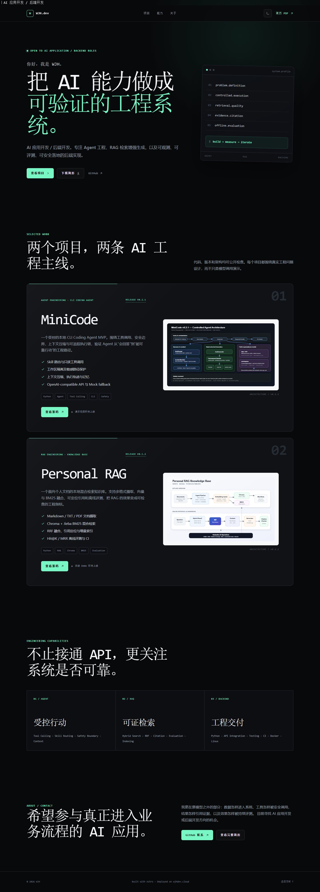

# WJH Interview Portfolio

WJH 的 AI 应用开发 / 后端开发面试作品集，集中展示：

- [MiniCode](https://github.com/wjh4sg/Mini-Code)：Agent、Tool Calling、CLI Coding Agent
- [Personal RAG](https://github.com/wjh4sg/personal-rag-knowledge-base)：混合检索、引用、评测与增量索引



## 本地运行

```bash
npm install
npm test
npm run build
npm run dev
```

生产构建输出到 `dist/`。主页使用 Astro + Tailwind CSS v4 构建，不依赖运行时后端。

## 更新内容

- 项目文案集中在 `src/config.ts`
- 替换简历：将新 PDF 覆盖到 `public/resume.pdf`
- 替换架构图：更新 `public/images/` 中对应的 SVG
- 发布前运行：

```bash
npm test
npm run check
npm run build
```

## 部署

线上地址：[www.wjhdev.cloud](https://www.wjhdev.cloud)

服务器使用不可变版本目录：

```text
/var/www/wjh-portfolio/releases/<timestamp>/
/var/www/wjh-portfolio/current
```

Nginx 配置模板位于 `deploy/nginx-wjhdev.cloud.conf`。更新时将新的 `dist/`
上传到新版本目录，验证文件后再原子切换 `current` 软链，并依次执行：

```bash
sudo /www/server/nginx/sbin/nginx -t
sudo systemctl reload nginx
```

配置保留 `/api/wechat/` 与 `/ordering-api/` 两个既有反向代理路由。

回滚时将 `current` 重新指向上一个版本；若同时修改过 Nginx，则恢复对应的
`sub2api.conf.backup-<timestamp>`，通过 `nginx -t` 后 reload。

## 许可与来源

本项目基于 Ryan Fitzgerald 的
[DevPortfolio](https://github.com/RyanFitzgerald/devportfolio) 模板改造。模板原始 MIT
License 保存在 `LICENSE.md`，来源说明见 `NOTICE.md`。
